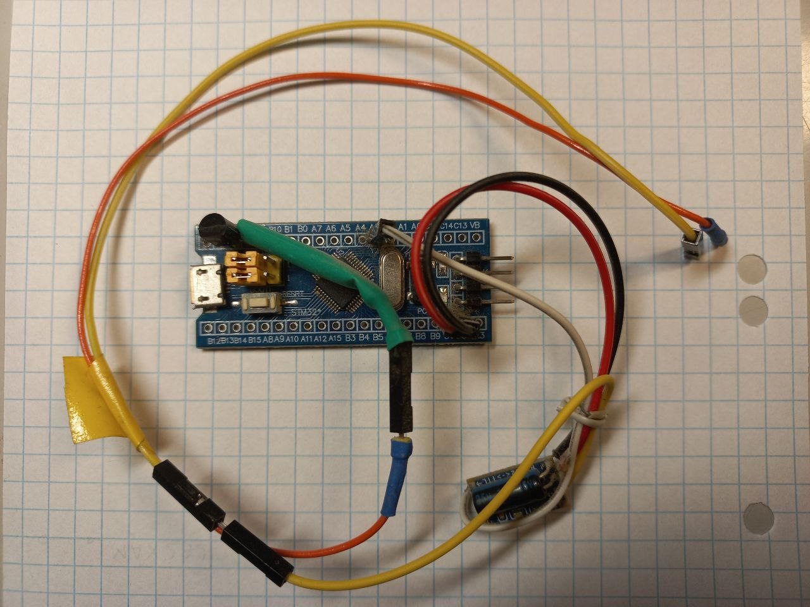
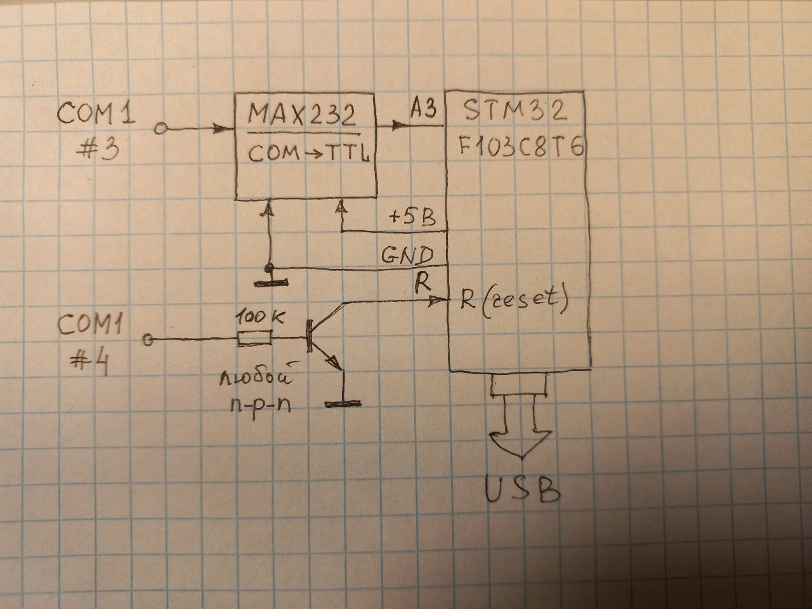

# USB Mouse + Keyboard Emulator with Serial Interface (STM32)

**Архивный проект 2019-21 года** — устройство на базе STM32, которое эмулирует USB HID-мышь и клавиатуру, получает пакеты команд по физическому COM-порту, перобразуя их в движения мыши и нажатия клавиатуры. Использовался в других моих проектах-автоматизациях.

Проект эволюционировал из простого теста LCD → в полноценное HID-устройство с последовательным интерфейсом. Содержит подключение к дисплею (на схеме не отражено, см. файл Core/Src/lcd_1602a.c), который отображает поступаемые из последовательного порта символы, служил для начальной отладки. В рабочем режиме не испольжуется.

## Возможности

- Эмуляция USB HID **мыши** (перемещение курсора, клики)
- Эмуляция USB HID **клавиатуры** (набор текста, специальные клавиши)
- Одновременная работа с физическим COM-портом для получения команд.
- Управление через терминал пакетами команд по специальному протоколу.
- Полностью на **STM32 HAL** + USB Device Library от ST
- Работает на STM32F103 (Blue Pill / Black Pill и т.п.)
- Поддерживает самодиагностику: если управляющая программа обнаружила отсутсвтвие реакции на передачи, она может перезагрузить устройство. Введено в рамках борьбы с очень редкими зависаниями по не понятным причинам.

## Фото устройства

  
*Собранное устройство (вид сверху)*

## Электрическая схема

  
*Полная электрическая схема*

Подробные файлы схемы:  
- (в планах) [KiCad проект → schematic.kicad_sch](hardware/schematics/)  
- (в планах) [Экспорт в PDF → schematic.pdf](hardware/schematics/schematic.pdf)

## Как открыть и собрать проект

1. Установи **STM32CubeIDE** (изначально создавался в 1.4, позже компилировался в версии 1.7)
2. File → Open Projects from File System... → укажи корень репозитория
3. Открой файл `*.ioc` в STM32CubeMX (если нужно изменить пины/настройки)
4. Project → Build All
5. Подключи ST-Link / USB → Run / Debug

**Прошивка без IDE** (опционально):  
Используй `*.hex` / `*.bin` из папки Release/Debug + STM32CubeProgrammer или dfu-util. (в репо не залиты, это сообщение оставлено для памяти)

## Как использовать

1. Подключи устройство по USB к компьютеру
2. Определится как:
   - HID Mouse + Keyboard
3. Команды передаются по особому протоколу через COM1 c этого же или другого компьютера, (!!!позже не забыть добавить ссылку)

## Зависимости / Требования

- STM32CubeIDE / STM32CubeMX
- STM32F103C8/R8 серия bluepill
- USB data-кабель (не !!! зарядный)
- используется совместно с преобразователем уровней COM → TTL на микросхеме MAX232 или аналогах.

## Disclaimer

Проект старый, не поддерживается.  
Код использовался у меня в 2019–2023 годах, но может потребовать адаптации под современные Cube-версии (HAL обновился).

Используй на свой страх и риск.  
Сообщения об ошибках / PR приветствуются!

## Лицензия

MIT License — см. файл [LICENSE](LICENSE)

## Контакты

Если хотите со мной связаться: телега @khasuist
